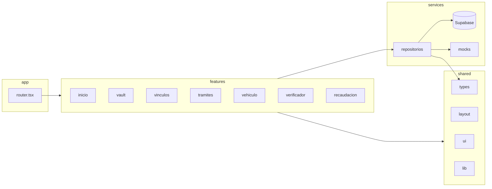

# Arquitectura

SPA React con Supabase como backend. Sin servidor propio. Arquitectura por **features verticales**
con una capa `shared` y una capa `services`. La regla que evita el espagueti es la de dependencias.

## Capas y regla de dependencia

```
app  →  features  →  shared
                 →  services  →  shared/types
```

| Capa | Qué contiene | Puede importar de |
|---|---|---|
| `app/` | Router, rutas, providers globales. Solo wiring. | features, shared |
| `features/<x>/` | Todo lo de UNA vista: página, componentes propios, hooks propios, estado local. | shared, services |
| `shared/` | Componentes UI puros, layout, hooks genéricos, helpers, tipos de dominio. | nada del proyecto (solo libs) |
| `services/` | Acceso a datos. Un repositorio por entidad. Único lugar que conoce Supabase. | shared/types |
| `mocks/` | Datos de demo. Usados por services cuando `VITE_USE_MOCKS=true`. | shared/types |

**Prohibido:** `features/a` importa `features/b`. Si dos features necesitan lo mismo, se sube a `shared/` o `services/`.
**Prohibido:** un componente importa `services/supabase/client.ts`. Siempre vía repositorio.

## Anatomía de una feature

```
src/features/vault/
  index.ts              → export { VaultPage } from './VaultPage'
  VaultPage.tsx         → página; compone componentes, llama hooks
  components/
    DocumentoCard.tsx
    SubirDocumentoModal.tsx
  hooks/
    useDocumentos.ts    → llama services/documentos.ts, maneja loading/error
```

Todo lo que no se use fuera de la feature vive adentro de la feature.

## Capa de servicios (repositorios)

```ts
// src/services/documentos.ts
import type { Documento } from '@/shared/types/domain'

export interface DocumentosRepo {
  listar(ciudadanoId: string): Promise<Documento[]>
  crear(doc: Omit<Documento, 'id' | 'creadoEn'>): Promise<Documento>
}

export const documentosRepo: DocumentosRepo = USE_MOCKS ? mockDocumentosRepo : supabaseDocumentosRepo
```

Cada repositorio tiene dos implementaciones: **mock** (en memoria, `src/mocks/`) y **supabase**.
Se elige por `VITE_USE_MOCKS`. Esto permite que el front se desarrolle sin que la DB esté lista,
y que la demo funcione offline si falla la red.

Mapeo snake_case (DB) ↔ camelCase (TS) se hace dentro del repositorio supabase, en un `toDomain()` / `toRow()`.

## Estado

- Estado de servidor (documentos, tokens, trámites): hooks por feature que llaman al repo. Sin librería global por ahora (ADR-0003 si cambia).
- Estado de UI (modales, tabs, filtros): `useState` local.
- Estado global mínimo (ciudadano actual, notificaciones): un `Context` en `app/providers/`.
- **No** usar `localStorage` como store: Supabase es la persistencia. `localStorage` solo para preferencias de UI.

## Realtime (demo de dos actores)

El Verificador y Recaudación se suscriben a cambios en `verificaciones` y `hechos_imponibles`
con `supabase.channel(...)`. Encapsulado en `services/realtime.ts`; las features usan un hook `useRealtime<T>(tabla)`.

## Componentes UI compartidos (`shared/ui`)

Primitivas sin lógica de negocio: `Button`, `Card`, `Badge` (estados), `Modal`, `ProgressBar`, `Input`, `Select`, `Skeleton`, `EmptyState`.
Si un componente sabe qué es un "documento" o un "token", **no** va en `shared/ui`.

## Diagrama


