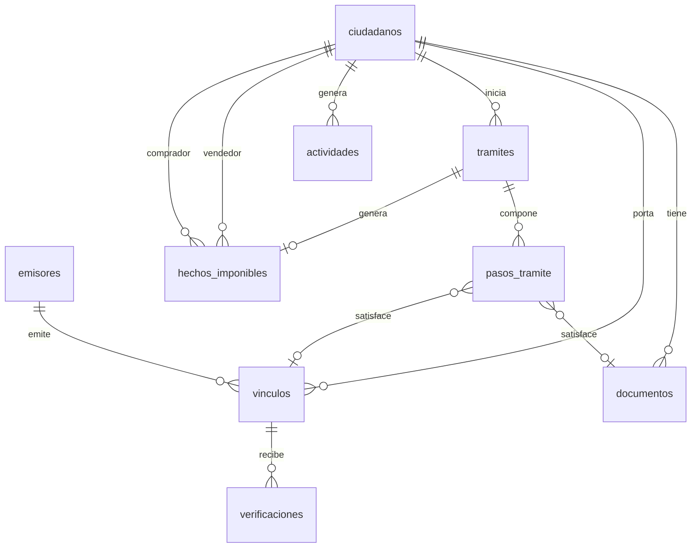

# Modelo de datos

Tipos TS en `src/shared/types/domain.ts`. SQL en `supabase/migrations/`. Deben coincidir siempre.
DB usa `snake_case`; TS usa `camelCase`; el mapeo vive en cada repositorio de `services/`.

## Entidades

| Tabla | Qué es | Notas |
|---|---|---|
| `ciudadanos` | Persona con carpeta | Demo: Carlos Mendoza (vendedor), María Torres (compradora) |
| `documentos` | Doc físico digitalizado con OCR | `campos_ocr` jsonb libre. `vence_en` null = sin vencimiento |
| `emisores` | Org certificada que emite tokens | Notarías, colegios de abogados, estudios |
| `vinculos` | Token firmado que apunta al doc en la fuente | `firma` es opaca al cliente. Nunca se edita desde el front |
| `tramites` | Quest del ciudadano | `tipo` es la clave del catálogo (`traspaso_vehicular`…) |
| `pasos_tramite` | Paso ordenado de un trámite | Puede referenciar el doc/vínculo que lo satisfizo |
| `hechos_imponibles` | Evento tributario por transferencia de bien | Ver RECAUDACION.md |
| `verificaciones` | Log de cada verificación de funcionario | Realtime hacia el panel |
| `actividades` | Feed de "actividad reciente" | Se inserta desde services al hacer cualquier acción |

## Estados

| Entidad | Estados |
|---|---|
| Documento | `vigente` `por_vencer` `vencido` `pendiente` |
| Vínculo | `activo` `por_vencer` `vencido` `revocado` |
| Trámite | `en_progreso` `completado` `disponible` `cancelado` |
| Paso | `completado` `en_progreso` `bloqueado` `pendiente` |
| Hecho imponible | `pendiente` `liquidado` `pagado` `anulado` |
| Verificación | `valido` `invalido` `vencido` |

`por_vencer` se calcula: vence en ≤ 30 días. Hacerlo en el repositorio al leer, no persistir.

## Seguridad (fase demo)

RLS deshabilitado. Antes de cualquier despliegue público: habilitar RLS, policies por `ciudadano_id = auth.uid()`, y mover la generación de `firma` a una Edge Function. Registrar en ADR cuando se haga.
