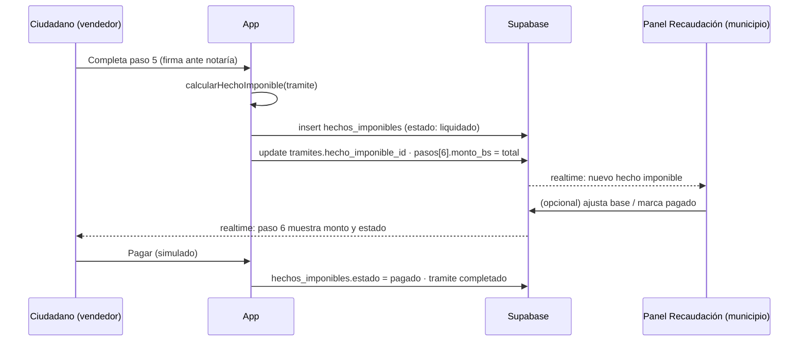

# Módulo de Recaudación — el diferenciador

**Problema que resuelve:** hoy el municipio se entera de una compraventa de vehículo o inmueble
solo si el ciudadano va a declararla. Con CarpetaCiudadana, el trámite de traspaso **genera
automáticamente un hecho imponible** cuando las partes firman. El municipio lo ve al instante,
liquida la tarifa y el ciudadano paga desde la app. Nadie hace cola, nadie evade.

## Flujo



## Cálculo (demo — parámetros configurables en `src/shared/lib/tributos.ts`)

```
baseImponibleBs = max(valorDeclaradoUsd × tipoCambio, valorBaseBs)
impuestoBs      = baseImponibleBs × alicuota
totalBs         = impuestoBs + arancelBs
```

| Parámetro | Vehículo | Inmueble | Fuente de referencia |
|---|---|---|---|
| `alicuota` | 3 % | 3 % | IMT (Impuesto Municipal a las Transferencias), Ley 843 art. 107 |
| `valorBaseBs` | valor fiscal RUAT | valor catastral | del documento en el vault |
| `arancelBs` | 450 | 800 | tasa municipal de trámite |
| `tipoCambio` | 6,96 | 6,96 | BCB |

> ⚠️ Son valores de demo aproximados. Para el pitch alcanza; para producción se parametriza por municipio.
> No presentar como cálculo legalmente exacto.

**Ejemplo Toyota Corolla:** USD 12.500 × 6,96 = Bs. 87.000. Base RUAT: Bs. 78.000. Base imponible = 87.000.
Impuesto 3 % = Bs. 2.610. Arancel Bs. 450. **Total Bs. 3.060.**

## Qué implementar

1. `shared/lib/tributos.ts` — `calcularHechoImponible(input): HechoImponible` puro y testeable.
2. `services/hechosImponibles.ts` — repo con `crear`, `listar(municipio)`, `marcarPagado`, `suscribir`.
3. En `features/tramites` — al completar el paso 5 de un trámite `traspaso_vehicular`, llamar al cálculo y crear el hecho.
4. `features/recaudacion` — la vista descrita en SPEC.md §7.
5. En `features/vehiculo` — el diagrama de flujo incluye el nodo "Hecho imponible liquidado".

## Guion para el pitch (dos pantallas)

Pantalla A (ciudadano, laptop) · Pantalla B (municipio, otra laptop o celular, misma URL en `/recaudacion`).

1. A: mostrar trámite al 60%. Simular llegada de DIPROVE → paso 4 ✅.
2. A: firmar ante notaría (paso 5) → aparece "Arancel liquidado: Bs. 3.060".
3. **B: la fila aparece sola, sin refrescar.** Ese es el momento.
4. B: "Marcar como pagado" → A: el trámite pasa a 100 % en vivo.
